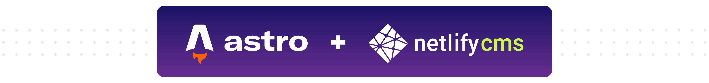

<p align="center">
Add <a href="https://www.netlifycms.org/">Netlify CMS</a>’s admin dashboard
to any <a href="https://astro.build/">Astro</a> project
</p>

## Installation

```bash
npm i astro-netlify-cms
```

## What is this?

This is an integration for the [Astro](https://astro.build/) site builder,
which adds support for [Netlify CMS](https://www.netlifycms.org/), an
open-source, Git-based content management system.

Adding the integration will:

- Add the Netlify CMS dashboard at `/admin` (or another route if you prefer)
- Inject Netlify’s [Identity Widget](https://github.com/netlify/netlify-identity-widget) across your site to support logging in to the admin app
- Run a [local proxy server](https://www.netlifycms.org/docs/beta-features/#working-with-a-local-git-repository) in `dev` mode to allow local content updates via the CMS

Usually each of these requires individual set up and configuration. Using this integration, you configure your CMS once in `astro.config.mjs`, sit back, and enjoy!

> Looking for a quick way to get started? [Try out the Blog Starter with Netlify CMS →](https://github.com/delucis/astro-netlify-cms-starter)

## Usage

### Experimental status

Third-party integrations are currently only supported behind a flag, so you’ll
need to update your Astro scripts to include the flag:

```bash
astro dev --experimental-integrations
astro build --experimental-integrations
astro preview --experimental-integrations
```

### Adding the integration

To add Netlify CMS to your project, import and use the integration in your
Astro config file, adding it to the `integrations` array.

```js
// astro.config.mjs

import { defineConfig } from 'astro/config';
import NetlifyCMS from 'astro-netlify-cms';

export default defineConfig({
  integrations: [
    NetlifyCMS({
      config: {
        backend: {
          name: 'git-gateway',
          branch: 'main',
        },
        collections: [
          // Content collections
        ],
      },
    }),
  ],
});
```

### Configuration options

You can pass an options object to the integration to configure how it behaves.

#### `adminPath`

**Type:** `string`  
**Default:** `'/admin'`

Determines the route where the Netlify CMS admin dashboard will be available on your site.

Feeling nostalgic for WordPress? You could set this to `'/wp-admin'`!

#### `config`

**Type:** `CmsConfig`

This option is **required**. It allows you to configure Netlify CMS with the
same options you would use when using Netlify CMS’s `config.yml` file format.

You can see [a full list of configuration options in the Netlify CMS docs](https://www.netlifycms.org/docs/configuration-options/).

At a minimum, you _must_ set the `backend` and `collections` options:

```js
config: {
  // Use Netlify’s “Git Gateway” authentication and target our default branch
  backend: {
    name: 'git-gateway',
    branch: 'main',
  },
  collections: [
    // Define a blog post collection
    {
      name: 'posts',
      label: 'Blog Posts',
      folder: 'src/pages/posts',
      create: true,
      delete: true,
      fields: [
        { name: 'title', widget: 'string', label: 'Post Title' },
        { name: 'body', widget: 'markdown', label: 'Post Body' },
      ],
    },
  ],
};
```

#### `previewStyles`

**Type:** `Array<string | [string, { raw: true }]>`

Sets custom CSS styles to apply in the Netlify CMS preview pane.

You can provide URLs to external CSS stylesheets (Google Fonts for example), paths to local CSS files in your project, or even raw CSS strings:

```js
previewStyles: [
  // Path to a local CSS file, relative to your project’s root directory
  'src/styles/main.css',
  // A URL to an externally hosted CSS file
  'https://fonts.googleapis.com/css2?family=IBM+Plex+Mono&display=swap',
  // Raw CSS!
  ['p { color: red; }', { raw: true }],
];
```
